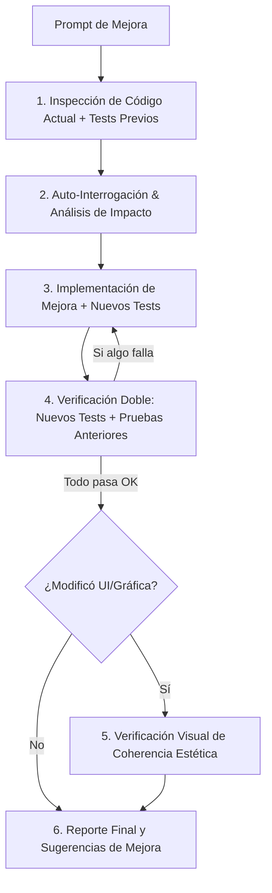
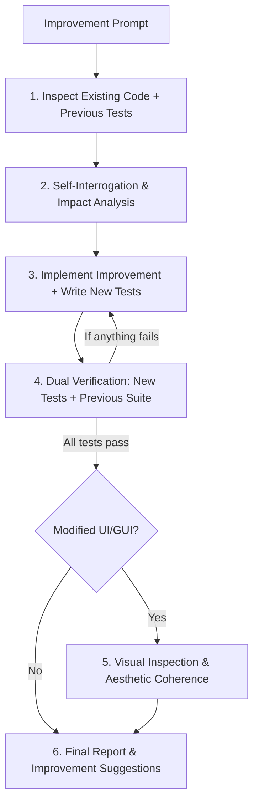

# QualityDev - Sistema Autónomo de Desarrollo Basado en Calidad y Verificación
# QualityDev - Autonomous Quality-Driven Development System

[Español](#-español) | [English](#-english)

---

## 🌐 Español

**QualityDev** es un sistema universal para desarrollo de software orientado a la calidad y verificación automática. Permite asignar tareas mediante prompts —tanto para **proyectos desde cero** como para **tareas de mejora sobre código ya existente**— y garantiza que cualquier modelo de IA o desarrollador:

1. **Auto-interrogue los requerimientos** y evalúe el impacto en el código existente antes de modificar nada.
2. **Genere código modular** en cualquier lenguaje (Python, JavaScript/TypeScript, Go, Rust, HTML/CSS, etc.).
3. **Cree y ejecute tests de calidad automatizados** garantizando que la nueva mejora pase y no se rompa la funcionalidad anterior (*Anti-regresión*).
4. **Inspeccione la interfaz gráfica (GUI/Web)** cuando aplique, evaluando aspectos estéticos, responsivos y de experiencia de usuario.
5. **Entregue un reporte estructurado** con posibles sugerencias de mejora al finalizar la tarea.

### 🔄 ¿Qué ocurre al solicitar una mejora en código existente?



### 🚀 Estructura del Sistema

```text
c:\Repositorios\project-master\
├── .agents/
│   └── skills/
│       └── quality-driven-dev/
│           └── SKILL.md            # Skill de Agente Universal para IA (Antigravity/Gemini/etc.)
├── quality_dev.py                  # Script ejecutable CLI portátil en Python
├── quality_dev.js                  # Script ejecutable CLI portátil en Node.js
└── README.md                       # Guía de uso y documentación (Bilingüe)
```

### 💻 Forma de Uso

#### Opción A: Uso como Skill de Agente (Recomendado para Asistentes de IA)
Para que el asistente de IA utilice automáticamente este flujo en un repositorio:
1. Copia la carpeta `.agents` a la raíz de tu proyecto o repositorio objetivo:
   ```bash
   cp -r .agents /ruta/a/tu/nuevo-repositorio/
   ```
2. Al asignarle una tarea al asistente, este aplicará la habilidad `quality-driven-dev` para responder las 5 fases.

#### Opción B: Uso mediante el Runner CLI (`quality_dev.js` / `quality_dev.py`)
Puedes llevar el archivo `quality_dev.js` (o `quality_dev.py`) a **cualquier carpeta o repositorio**.

```bash
# 1. Analizar una Tarea/Mejora y Ejecutar Pruebas Automatizadas:
node quality_dev.js --prompt "Agregar autenticación JWT a la API existente"

# 2. Ejecutar en un Repositorio Específico:
node quality_dev.js --prompt "Optimizar consultas SQL" --dir /ruta/a/mi-proyecto

# 3. Generar la Matriz de Auto-Preguntas Fases 1 & 2:
node quality_dev.js --prompt "Diseñar interfaz gráfica de usuario" --questions

# 4. Obtener Salida Estructurada en JSON:
node quality_dev.js --prompt "Refactorizar API REST" --json
```

---

## 🌐 English

**QualityDev** is a universal system for quality-driven development and automated verification. It allows assigning tasks via prompts —for both **new projects from scratch** and **improvement/refactoring tasks on existing codebases**— ensuring that any AI model or developer:

1. **Self-interrogates requirements** and assesses impact on existing code before making changes.
2. **Generates clean, modular code** in any programming language (Python, JavaScript/TypeScript, Go, Rust, HTML/CSS, etc.).
3. **Creates and executes automated quality tests**, guaranteeing new features pass and existing functionality remains unbroken (*Anti-regression*).
4. **Inspects graphical user interfaces (GUI/Web)** when applicable, evaluating visual aesthetics, responsiveness, and user experience.
5. **Delivers a structured report** with prioritized future improvement suggestions upon completion.

### 🔄 What happens when requesting an improvement on existing code?



### 🚀 System Architecture

```text
repository-root/
├── .agents/
│   └── skills/
│       └── quality-driven-dev/
│           └── SKILL.md            # Universal AI Agent Skill (Antigravity/Gemini/etc.)
├── quality_dev.py                  # Portable CLI runner script in Python
├── quality_dev.js                  # Portable CLI runner script in Node.js
└── README.md                       # Documentation & Usage Guide (Bilingual)
```

### 💻 How to Use

#### Option A: Use as an Agent Skill (Recommended for AI Assistants)
To enable AI assistants to automatically follow this quality workflow in any project:
1. Copy the `.agents` folder to the root of your target repository:
   ```bash
   cp -r .agents /path/to/your/target-repository/
   ```
2. Prompt the AI assistant with your task; it will execute the 5 quality phases.

#### Option B: Use via CLI Runner (`quality_dev.js` / `quality_dev.py`)
You can drop `quality_dev.js` (or `quality_dev.py`) into **any project folder or repository**.

```bash
# 1. Analyze a task and run automated tests:
node quality_dev.js --prompt "Add JWT authentication to existing API"

# 2. Run on a specific project directory:
node quality_dev.js --prompt "Optimize SQL queries" --dir /path/to/my-project

# 3. Generate self-question matrix (Phases 1 & 2):
node quality_dev.js --prompt "Design user interface" --questions

# 4. Get structured output in JSON:
node quality_dev.js --prompt "Refactor REST API" --json
```

---

## 🧪 Automatically Supported Tech Stacks / Stacks Soportados

| Language / Environment | Detected Runner | Automatic Command |
| :--- | :--- | :--- |
| **Python** | `pytest` / `unittest` | `pytest -v` or `python -m unittest` |
| **JavaScript / TypeScript** | `npm test` / `vitest` / `jest` | `npm test` or `npx vitest run` |
| **Go** | `go test` | `go test ./...` |
| **Rust** | `cargo test` | `cargo test` |
| **Static Web / Frontend** | Detects HTML/CSS/React/Vue | Enables UI & Accessibility checklist |
